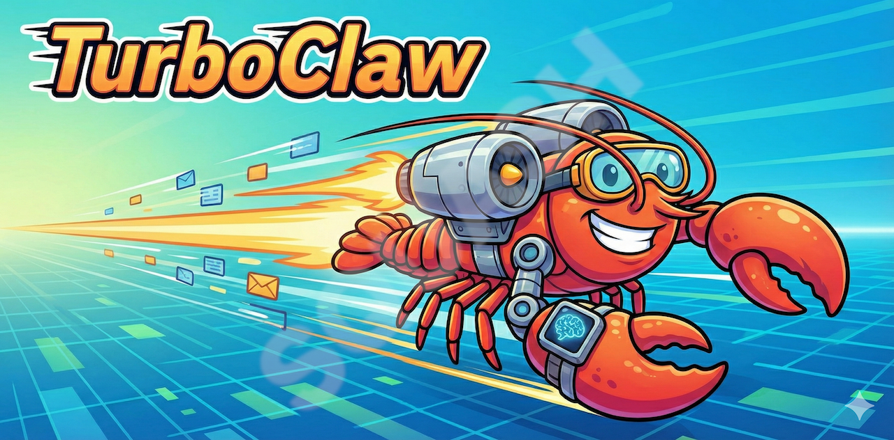

# TurboClaw

> AI agent orchestration for Claude Code — built with Bun and TypeScript

TurboClaw runs multiple Claude Code agents simultaneously, each with their own Telegram bot, skills, memory, and scheduled tasks. A long-running daemon handles the queue, heartbeats, and scheduling. A concise CLI manages everything else.

## Why TurboClaw?

[OpenClaw](https://github.com/openclaw) was the inspiration, but it was too buggy and poorly documented to rely on. TurboClaw is a clean rewrite with different priorities:

- **Uses Claude Code** — works with your existing Claude Code subscription, within Anthropic's terms of service. No API key required, no risk of account issues.
- **Built on Bun** — fast startup, native TypeScript, low memory footprint. Runs comfortably on a Raspberry Pi or any modest VPS.
- **Simple by design** — one config file, one daemon process, one CLI. No Kubernetes, no message broker, no database.
- **Actually documented** — every command has help text, setup is interactive, and the code is readable.

## Features

- **Multiple agents** — Each agent has its own bot token, working directory, and identity
- **Telegram integration** — Direct chat with each agent; whitelist-based auth (no pairing)
- **Streaming responses** — Live updates as Claude generates, with typing indicator
- **Media support** — Voice messages (with transcription), photos, and documents
- **Voice transcription** — Any OpenAI-compatible provider (OpenAI, Groq, Mistral Voxtral…)
- **Task scheduler** — Built-in cron system; no system cron needed
- **Heartbeats** — Agents check in proactively on a configurable interval
- **Memory system** — Persistent memory with daily logs and consolidation (shared or isolated)
- **Skills system** — Modular capabilities installed into each agent's workspace
- **Crash protection** — CrashGuard prevents runaway restart loops

## How it works

TurboClaw runs agents using **Claude Code** — the same tool you use interactively in your terminal. Each agent is a Claude Code process running in its own working directory, managed by TurboClaw's daemon. Because it drives Claude Code rather than calling the API directly, it works within your existing subscription and Anthropic's terms of service.

**Prerequisites:**
- [Claude Code](https://claude.ai/download) installed and authenticated (`claude --version` should work)
- [Bun](https://bun.sh) runtime

## Installation

```bash
git clone https://github.com/ikmolbo/TurboClaw.git
cd TurboClaw
./install.sh
```

`install.sh` installs Bun if it's missing, runs `bun install`, links the `turboclaw` command globally, and launches the setup wizard immediately. That's all you need.

> **Note:** After install, open a **new terminal** for the `turboclaw` command to be available. If it still isn't found, run `source ~/.zshrc` (or `~/.bash_profile`) to reload your PATH.

To uninstall:

```bash
./uninstall.sh
```

This removes the global `turboclaw` command. Your config and data in `~/.turboclaw` are left untouched — the script tells you how to remove those too if you want a clean slate.

**Manual install** (if you prefer):

```bash
bun install
bun link
turboclaw setup
```

## Configuration

The interactive setup wizard (`turboclaw setup`) creates `~/.turboclaw/config.yaml`, prompts for your workspace path, optional Telegram allowed-user whitelist, and optionally walks through creating your first agent. If the config file already exists, existing values are used as defaults.

Or copy the example config manually:

```bash
mkdir -p ~/.turboclaw
cp examples/config.yaml ~/.turboclaw/config.yaml
```

`~/.turboclaw/config.yaml`:

```yaml
workspace:
  path: ~/.turboclaw/workspaces

# Whitelist of Telegram user IDs (omit to allow all users)
# allowed_users:
#   - 123456789

providers:
  anthropic:
    # api_key: sk-ant-...       # or use ANTHROPIC_API_KEY env var
    # base_url: https://...     # optional custom endpoint

agents:
  coder:
    name: Code Assistant
    provider: anthropic
    model: sonnet               # opus, sonnet, haiku, or full model ID
    working_directory: ~/.turboclaw/workspaces/coder
    heartbeat_interval: 10800   # seconds (3 hours), or false to disable
    memory_mode: isolated       # shared or isolated
    telegram:
      bot_token: "123456:ABC..."

# Audio transcription (optional)
# transcription:
#   enabled: true
#   provider: openai            # must match a key in providers above
#   model: whisper-1
#   retain_audio: false
```

See `examples/config.yaml` for the full documented example.

**Authentication:** TurboClaw uses a whitelist instead of a pairing system. Add your Telegram user ID to `allowed_users`. Leave it empty to allow anyone who knows the bot token.

**Model shorthands:** `opus`, `sonnet`, `haiku` expand to the latest corresponding model IDs.

## Daemon

```bash
turboclaw start    # Start daemon in background (PID file at ~/.turboclaw/daemon.pid)
turboclaw stop     # Stop daemon
turboclaw status   # Show daemon status, agent list, queue depth
```

The daemon is a single foreground process managed by a PID file. It polls the queue every second, runs the scheduler every 30 seconds, and fires heartbeats on each agent's configured interval.

## Managing Agents

```bash
turboclaw agents list              # List configured agents
turboclaw agents add               # Interactive wizard
turboclaw agents show <id>         # Show agent details
turboclaw agents remove <id>       # Remove agent
```

The `add` wizard prompts for name, provider, model, memory mode, Telegram bot token, and skills. It then writes the config, scaffolds the working directory with default templates (`CLAUDE.md`, `HEARTBEAT.md`, `LEARNINGS.md`, `ONBOARDING.md`), installs bundled skills, and sets up the memory directory.

## Memory

Each agent gets a `memory/` directory containing:

```
memory/
├── MEMORY.md          # Consolidated long-term memory
├── daily/
│   └── YYYY-MM-DD.md  # Daily incremental logs
└── archive/           # Archived daily logs post-consolidation
```

**Shared mode** (`memory_mode: shared`): all agents symlink to a single `~/.turboclaw/workspaces/shared/` directory. Useful for teams of agents that need shared context.

**Isolated mode** (`memory_mode: isolated`): each agent gets its own `memory/` inside its working directory.

The `turboclaw setup` wizard bootstraps the shared memory directory automatically.

## Scheduling

```bash
turboclaw schedule list             # List tasks with next-run times
turboclaw schedule add              # Interactive wizard
turboclaw schedule remove <name>    # Delete a task
turboclaw schedule enable <name>    # Re-enable a disabled task
turboclaw schedule disable <name>   # Temporarily disable
```

Tasks are YAML files in `~/.turboclaw/tasks/`. The daemon runs them without system cron. Standard cron expressions (minute-precision) are supported.

Example task file:

```yaml
name: daily-standup
schedule: "0 9 * * 1-5"
action:
  type: agent-message
  agent: coder
  message: "Good morning! Summarize your open tasks."
enabled: true
```

### Conditional tasks

Add a `condition` shell command to the action block. The daemon runs it first — if it exits non-zero the task is silently skipped, no agent is invoked. This avoids redundant LLM calls when the work isn't needed yet (e.g. no new data, market is closed, a flag file is absent).

```yaml
name: process-new-data
schedule: "0 * * * *"   # every hour
action:
  type: agent-message
  agent: analyst
  message: "Process the new data and update the summary."
  condition: "test -f /tmp/data-ready.flag"   # skip if flag absent
enabled: true
```

The condition is any shell one-liner: file checks, HTTP pings, exit-code from a script — anything that returns 0 to proceed or non-zero to skip.

## Sending Messages and Resetting Context

```bash
turboclaw send --agent <id> --message "Run the test suite"
turboclaw reset-context <agent-id>
```

`send` enqueues a message directly without going through Telegram. `reset-context` clears the agent's conversation so the next interaction starts fresh.

## Streaming

As Claude generates tokens, TelegramStreamer accumulates chunks and edits the in-progress Telegram message every ~2.5 seconds so the user sees output live. Once the full response arrives, the streaming message is deleted and the final formatted response is sent. The typing indicator is active while the agent is working and cleared automatically on delivery.

## Voice Transcription

When a user sends a voice message, TurboClaw downloads it from Telegram and posts it to your configured transcription provider. The transcribed text is processed as a regular message. Photos and documents without a caption are sent to the agent as `[Image]` or `[Document]`.

```yaml
providers:
  mistral:
    api_key: sk-...
    base_url: https://api.mistral.ai/v1

transcription:
  enabled: true
  provider: mistral
  model: voxtral-mini-latest
  retain_audio: false
```

Compatible with OpenAI, Groq, Mistral (Voxtral), and any OpenAI-compatible transcription endpoint.

## Skills

Skills are Claude Code skill files installed into each agent's `.claude/skills/` directory. Bundled skills:

- `turboclaw-memory` — Daily logging, consolidation, and recall. Supports both shared and isolated memory modes.
- `turboclaw-send-user-message` — Send a message back to the user via Telegram
- `turboclaw-schedule` — View and manage scheduled tasks from within a conversation

See `skills/README.md` for adding custom skills.

## Crash Protection

CrashGuard tracks how many times the daemon has crashed recently. If it exceeds the threshold (5 crashes in 15 minutes), it stops auto-restarting to prevent runaway token spend.

```bash
turboclaw reset-crashes
turboclaw start
```

## Development

```bash
bun test              # Run all tests
bun test --watch      # Watch mode
bun test tests/foo.test.ts  # Single file
```

## Project Structure

```
src/
  cli/
    index.ts                 # Arg parsing and command dispatch
    commands/                # start, stop, status, agents, schedule, send, reset-context, setup
  config/index.ts            # Config loader and Zod schema
  daemon/index.ts            # Foreground daemon, queue polling, scheduler loop
  agents/executor.ts         # Claude Code executor with streaming callbacks
  channels/telegram.ts       # Bot listener, TelegramStreamer, whitelist auth
  scheduler/index.ts         # Cron scheduler
  lib/
    queue.ts                 # File-based message queue
    logger.ts                # Structured logger with colored symbols
    crash-guard.ts           # Crash loop detection
    transcription.ts         # OpenAI-compatible audio transcription client
    templates.ts             # Agent workspace scaffolding and memory setup
tests/                       # bun:test test suite (527 tests)
examples/config.yaml         # Documented configuration example
skills/                      # Bundled skill files
templates/                   # Agent workspace template files
```

## License

MIT
